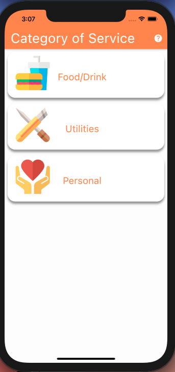
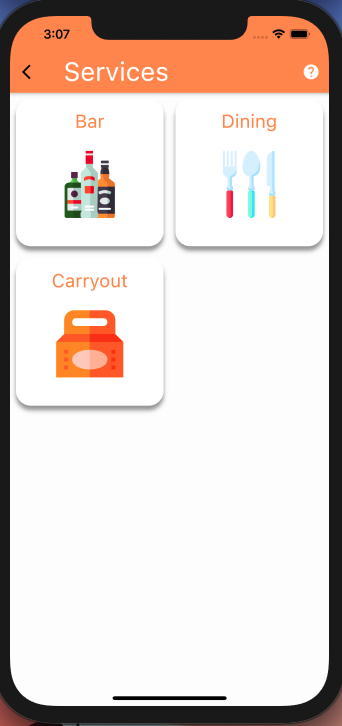
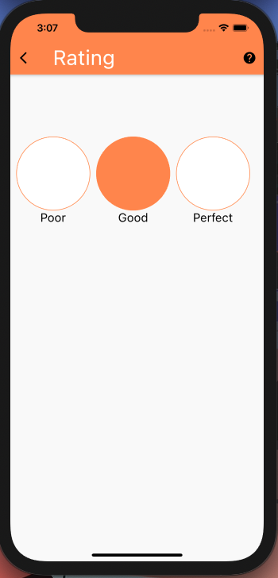
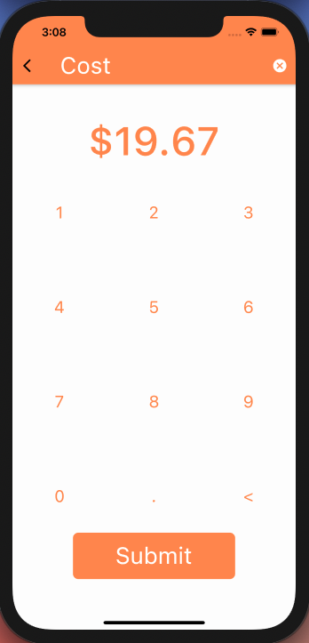
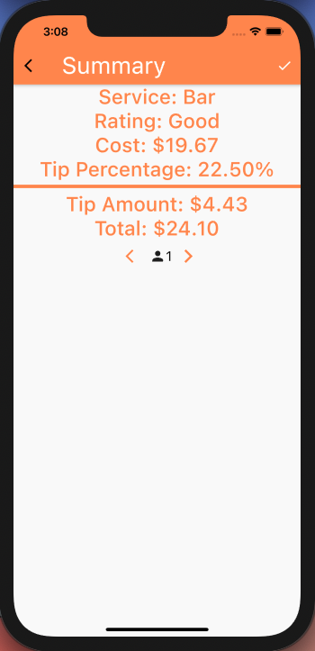

# ToTip
Flutter application that calculates the amount you should tip for a particular service

## Category Screen
### Select the category of service
 

## Service Screen 
### Select the service that was recieved
 

## Rating Screen 
### Rate the service that you recieved
 

## Calculator Screen 
### Enter the billed amount for the service
 

## Summary Screen 
### View a summary of the bill and how much you should tip. You may also calculate the amount of money per person if splitting the bill. 
  

